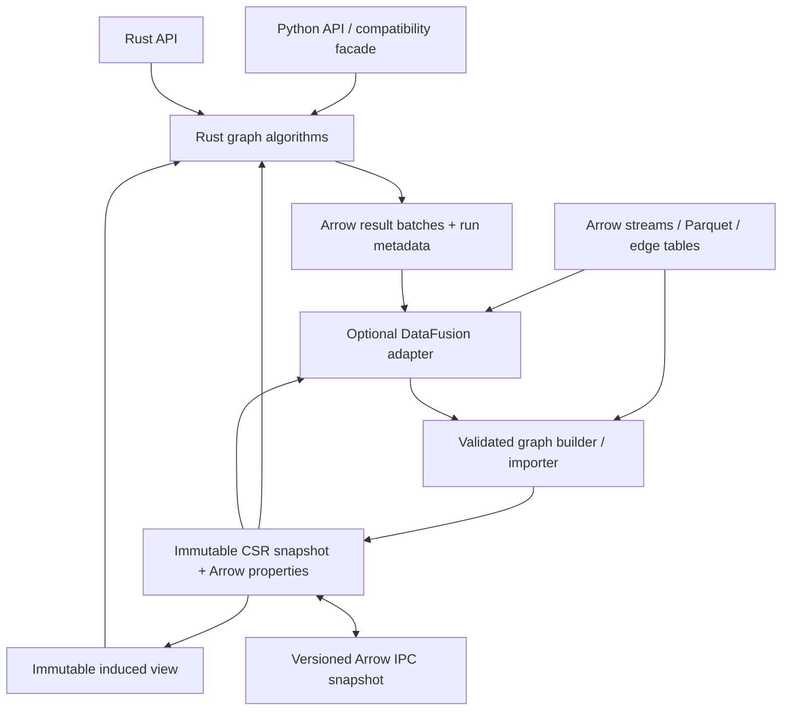

# Rust rewrite: code review and implementation plan

Terminology: Icebug = original Arrow-enabled NetworKit (C++); Icecat = first Rust
rewrite; Grustcat = Grust-compatible Rust rewrite.

Review baseline: `a7d7cd7c9` (Icebug 13.4), 2026-09-12. An experimental implementation
now exists in `rust/`. See [implementation status](rust-rewrite-status.md) for
verified capabilities and outstanding release gates. This document preserves the
original review and design rationale; its review-time environment notes are historical.

For work-package prerequisites, proposed modules, acceptance criteria, the first
two weeks of work, and the PR sequence, see the
[detailed execution roadmap](rust-rewrite-roadmap.md).

**Primary goal (confirmed 2026-09-13): make Icecat Grust-compatible.**
Use the local `~/src/grust` model, identity and property semantics as the
compatibility target. Arrow-native, read-only analytics remains the execution
design; a focused Python API and legacy `networkit` compatibility follow the
Grust contract rather than determine it. DataFusion remains optional for
relational preparation and analysis around graph computation.

Compatibility means that both the Icecat CSR and Grustcat variants can
consume and emit the same Arrow graph tables and IPC files, preserve supported
node/edge IDs, labels, properties, null-versus-absent values and isolated nodes,
and return equivalent algorithm results with explicit mappings to Grust IDs.
Storage layouts may differ; conversions, allocations and unsupported semantics
must be explicit. Do not silently collapse Grust parallel edges into a simple
graph or discard unsupported property values.

The local `grust-arrow` and `grustcat` implementations establish an initial
scalar-property, directed-graph subset. They do not establish full Grust
compatibility. The next planning gate is a versioned compatibility matrix and
cross-backend conformance suite, followed by closing property-type and
multi-batch Arrow gaps. Extend analytics coverage, Python conveniences and
legacy compatibility only against that agreed contract.

The proposed first release covers construction, properties, views, traversal,
components, and PageRank. Community detection follows as a separate correctness
milestone. Replacing the full inherited NetworKit API is a substantially larger
program and should require an explicit feature inventory and usage priorities.

**Review scope and limits.** This is a source review of storage, representative
algorithms, Cython ownership, tests, build configuration, and CI, supplemented by
current official Arrow/DataFusion documentation. It is not a line-by-line audit
of every algorithm. No C++/Python tests or benchmarks were run: this checkout has
no built extension or build tree, and the available Python environment lacks
PyArrow, pytest, and icebug-format. Findings below identify concrete source paths;
runtime reproducers and performance baselines are Phase 0 deliverables.

**Scale.** The source inventory contains 431 C++ source files, 426 C++
headers, and 31 Cython modules: approximately 80k, 44k, and 24k lines respectively,
including tests. Outside C++ test directories there are 327 source files and
approximately 48k lines, including the top-level test runner. Cython has 342
top-level class declarations, including helpers and enums. The test inventory has
408 test declarations across 34 top-level Python test files and 965 test macros
across 92 `*GTest.cpp` files. These are source counts, not collected or passing tests.

## Findings that should drive the rewrite

| Priority | Finding and evidence | Consequence for the design |
| --- | --- | --- |
| Critical | Directed `fromCSR` accepts missing incoming arrays; `fromIcebugMemGraph` always omits them ([graph.pyx:221](../networkit/graph.pyx#L221), [430](../networkit/graph.pyx#L430)). `inNeighbors` dereferences them through `neighborsAt` ([GraphR.hpp:55](../include/networkit/graph/GraphR.hpp#L55), [312](../include/networkit/graph/GraphR.hpp#L312)); PageRank uses incoming traversal ([PageRank.cpp:283](../networkit/cpp/centrality/PageRank.cpp#L283)). | The documented construction path can reach a null dereference. Make incoming adjacency a validated capability, with explicit construction/preparation and allocation policy. Check incoming weights too. |
| Critical | CSR construction checks array lengths but does not establish offset monotonicity, bounds, null freedom, sorted rows, or reciprocal/transpose consistency ([GraphR.cpp:31](../networkit/cpp/graph/GraphR.cpp#L31)). Traversal uses raw pointers; lookup assumes sorting ([GraphR.cpp:66](../networkit/cpp/graph/GraphR.cpp#L66)). | Malformed offsets can lead to invalid memory access; an unsorted row can return incorrect lookup results. Create a validated CSR type before exposing traversal. |
| High | Component wrappers declare `_G` but constructors such as `ConnectedComponents` never retain the input ([components.pyx:27](../networkit/components.pyx#L27), [125](../networkit/components.pyx#L125)). Native decomposition stores a borrowed graph pointer ([ComponentDecomposition.hpp:66](../include/networkit/components/ComponentDecomposition.hpp#L66)). | A temporary graph can be destroyed before `run()`. Every deferred Python operation must own its snapshot; add destruction/GC regression tests. |
| High | CSR loop count stays zero and undirected edge count is adjacency length divided by two ([GraphR.cpp:19](../networkit/cpp/graph/GraphR.cpp#L19)). Tests explicitly exclude undirected loops ([GraphGTest.cpp:128](../networkit/cpp/graph/test/GraphGTest.cpp#L128)). | Specify logical edges separately from adjacency slots. With one-slot loops, use `(slots + loops) / 2` after symmetry validation. |
| High | Python `PageRank.forWeights` sends raw weights to a C++ constructor that skips normalization/validation ([centrality.pyx:2578](../networkit/centrality.pyx#L2578), [2613](../networkit/centrality.pyx#L2613); [PageRank.cpp:87](../networkit/cpp/centrality/PageRank.cpp#L87)). Empty-graph execution reaches `scoreData[0]` ([381](../networkit/cpp/centrality/PageRank.cpp#L381)). | Share one validated configuration path across APIs. Specify empty graphs, finite weights, duplicate personalization sources, convergence, and normalization. Do not encode these defects as compatibility requirements. |
| Medium | Sparse PageRank scans all `k` personalization entries for every node ([PageRank.cpp:281](../networkit/cpp/centrality/PageRank.cpp#L281)); factories do not enforce the small-support threshold. The C++ weighted factory allocates dense temporaries ([144](../networkit/cpp/centrality/PageRank.cpp#L144)). | Target `O(n + a + k)` work per iteration and `O(k)` personalization storage; add sparse contributions in a separate pass. Measure peak allocations, not just retained state. |
| Medium | The IcebugMemGraph adapter extracts topology and passes no properties or weights ([graph.pyx:404](../networkit/graph.pyx#L404)). It only accepts homogeneous node tables ([393](../networkit/graph.pyx#L393)). Standard readers and GraphBuilder produce GraphW ([GraphReader.hpp:36](../include/networkit/io/GraphReader.hpp#L36); [GraphBuilder.cpp:236](../networkit/cpp/graph/GraphBuilder.cpp#L236)). | Treat batch-to-CSR construction and property alignment as new workstreams. Specify an adapter contract with icebug-format; its external implementation was not reviewed here. |
| Medium | Both Leiden wrappers document possible disconnected communities ([community.pyx:722](../networkit/community.pyx#L722), [759](../networkit/community.pyx#L759)). A move-scoring shared-library extension is exposed ([782](../networkit/community.pyx#L782)). | Community quality requires an independent oracle and connectedness/refinement tests. Inventory the extension ABI explicitly before replacement. |
| Medium | Repeated Python test names shadow earlier tests: `testNodeAttributeReadWrite` ([test_graph.py:294](../networkit/test/test_graph.py#L294), [401](../networkit/test/test_graph.py#L401)); `testPLM` and `testCutClustering` also repeat in `test_community.py`. The Arrow/PageRank example creates Python lists ([test_arrow_pagerank.py:59](../networkit/test/test_arrow_pagerank.py#L59)). | Repair test collection and add real buffer-sharing/allocation tests before accepting legacy parity as evidence of correctness or zero-copy behavior. |

There is useful architecture to retain. `GraphW` owns mutable adjacency,
`GraphR` owns Arrow arrays, and `GraphLike`/`IndexedGraph`/`MutableGraph` separate
capabilities ([GraphConcepts.hpp:93](../include/networkit/graph/GraphConcepts.hpp#L93)).
`Graph` is a non-owning reference handle ([Graph.hpp:27](../include/networkit/graph/Graph.hpp#L27)).
Python graph seats generally retain owners and view bases
([graph.pyx:65](../networkit/graph.pyx#L65)); ownership problems should be traced
per wrapper, not attributed to all Arrow sharing. Induced views already support
compact IDs and filtered traversal, but require an unmodified, live base
([InducedSubgraphView.hpp:46](../include/networkit/graph/InducedSubgraphView.hpp#L46)).

Some erased iterators visit variants per edge, and view cursors use virtual
dispatch ([ReferenceGraph.hpp:75](../include/networkit/graph/ReferenceGraph.hpp#L75),
[167](../include/networkit/graph/ReferenceGraph.hpp#L167)). This is a performance
hypothesis to benchmark, not an established regression. The Rust kernels should
dispatch once per graph representation and use typed traversal inside hot loops.

## Proposed architecture

This diagram shows data flow. The core crate has no dependency on DataFusion,
Tokio, Python, or the legacy C++ implementation.

| Workspace component | Responsibility and boundary |
| --- | --- |
| `icebug-core` | IDs, graph errors, immutable CSR topology, capability traits, builder, validation, views, property association, resource estimates. Depends on narrow arrow-rs buffer/array/schema crates. |
| `icebug-algorithms` | Traversal, components, centrality, later community kernels. Own execution context, cancellation, deterministic mode, reusable scratch space, Arrow results. Optional Rayon parallelism. |
| `icebug-io` | Arrow batch/stream adapters, IPC snapshot manifest and validation, icebug-format compatibility. No graph algorithms. |
| `icebug-datafusion` | Optional DataFusion registration, preparation queries, graph table providers, result tables, memory-accounting adapter. |
| `icebug-python` | PyO3 extension built with maturin; Arrow capsule import/export, exception mapping and Python ownership. Thin Python conveniences and a separately scoped compatibility facade. |
| `benchmarks` and `compat-tests` | Shared fixtures, independent reference implementations, C++/Rust comparison harness, memory and throughput reports. Keep legacy execution outside Rust production crates. |

Begin with modules where separate crates would add only scaffolding; preserve
these dependency boundaries. Avoid a crate for each algorithm. Expose concrete
types until a second implementation demonstrates a need for abstraction.

### Graph and identity contracts

1. **Immutable snapshots.** `GraphSnapshot` owns an `Arc` of validated topology
   and associated immutable property batches. Cloning is shallow; rebuilding or
   filtering produces a new snapshot. `GraphBuilder` owns mutable construction
   state and freezes into a snapshot. A full mutable analytics graph is deferred.
2. **Typed storage.** Start with `u64` dense internal node IDs, `u64` CSR offsets,
   and optional `f64` weights. Use Arrow typed arrays/`ScalarBuffer`-style owners
   and borrow slices for traversal. Check conversions to `usize` and Arrow's
   signed length domain. Support 64-bit platforms initially. A `u32` adjacency
   specialization is a later benchmark-driven optimization.
3. **External IDs.** Preserve original node IDs in an Arrow column and an explicit
   mapping to dense IDs. With a node table, internal order follows its rows;
   duplicate external IDs and dangling endpoints fail validation. With only an
   edge table, deterministic ID assignment is an explicit builder option.
   Initially accept non-null Int64, UInt64, or Utf8 keys with matching endpoint
   types; signed external labels may be negative, while CSR indices may not.
   Normalize dictionary encoding explicitly and match DataFusion's key equality.
   Preserve isolated nodes supplied in the node table. Never size scratch arrays
   by the largest external ID. Homogeneous graphs are the first-release scope.
4. **Logical edges.** Distinguish `NodeId`, `EdgeId`, and `ArcSlot` with newtypes.
   Directed edges have one outgoing slot; undirected non-loop edges have two
   slots and loops have one. Sorted, unique neighborhoods are the initial
   contract. Duplicate input edges fail by default; explicit normalization can
   deduplicate or aggregate with a declared weight/property policy. Multigraph
   analytics is deferred. Reciprocal rows of undirected CSR are representation,
   not duplicate logical edges.
5. **Properties.** Retain nullable Arrow columns without per-property hash maps.
   Node properties align to internal node rows. Canonical edge properties align
   to logical edges; adjacency stores a mapping when slot identity differs.
   Transpose construction and undirected mirroring must preserve this mapping.
   Reordered/merged properties may require `take`/aggregation and allocation.
   Define whether external edge IDs survive normalization or get an explicit
   input-to-output mapping. A minimal topology-only graph need not allocate IDs.
6. **Weights.** Unweighted graphs synthesize 1.0 without an edge-length array.
   Present-but-empty weights preserve weightedness. Structural import rejects
   null or non-finite weights; negative weights can be stored but algorithms
   such as Dijkstra/PageRank reject them. PageRank treats zero total outgoing
   weight as dangling. Each algorithm declares its weight and loop domain.
7. **Incoming adjacency.** Separate outgoing and bidirectional capabilities.
   `from_csr` accepts `reverse="none"`, `"provided"`, or `"build"`; never infer
   that missing incoming data means no incoming edges. `prepare_incoming(ctx)`
   returns a prepared handle sharing outgoing storage and owning a validated
   transpose. Incoming-dependent kernels require that handle. High-level APIs
   may explicitly request preparation, with its cost in the run report;
   `copy="never"` import and transpose allocation remain separate policies.
8. **Views.** An induced view owns an `Arc` to its base plus a fixed selection and
   ID mapping. Borrowed Rust iterators cannot outlive it. Default compact IDs
   follow ascending base IDs, matching current compact views. Changing selection
   creates a new view. Choose sparse selection maps versus bitmaps by density;
   report whether scratch space scales with view or base size. Expose an explicit
   `materialize()` path when repeated filtering costs more than rebuilding CSR.

For directed weighted traversal, benchmark contiguous weights in both directions
against an incoming permutation into canonical weights. The former uses more
memory; the latter adds gathers. Do not force all kernels to pay property lookup
costs when they need only topology or one weight column.

### Validation and zero-copy behavior

Public constructors return `Result` after checking array type, required pairs,
nulls, offset count `n+1`, offset origin, monotonicity, terminal offset equal to
adjacency length, endpoint bounds, per-row ordering, duplicates, and weight
length. Validate undirected symmetry and any supplied transpose, including
weights and edge association. Check all length/arithmetic overflows before
allocation. Structural checks are `O(n+a)`; exact reciprocal/transpose validation
may require extra indexing or sorting and must have a documented budget.

Array slicing must respect the Arrow logical offset. Row pointers must be
relative to the imported neighbor slice; rebasing an arbitrary CSR fragment is
an explicit conversion. Do not conflate missing arrays with empty arrays.
The existing helper does so ([Vector2Arrow.hpp:18](../include/networkit/auxiliary/Vector2Arrow.hpp#L18)).

Arrow supplies buffers and a columnar interchange format, not graph invariants.
Its format favors contiguous analytical reads, which fits immutable topology and
property columns. CSR offsets (`n+1`) and targets (`a`) are independent arrays:
they cannot be equal-length scalar columns in one record batch. Use separate
topology sections rather than padding one to match the other. A `LargeList`
representation would require signed offsets and its own compatibility decision.
([Arrow columnar format](https://arrow.apache.org/docs/format/Columnar.html))

Expose `copy="never" | "if_needed" | "always"` and an import report listing
bytes shared, copied, cast, rechunked, reordered, and allocated for indexes.
`never` fails if the requested import needs conversion. Validating shared data
still reads it and takes time. Single-chunk compatible arrays can share buffers;
casts, sorting, ID mapping, and multi-chunk coalescing generally allocate.
Property batches may stay chunked even when topology is normalized to contiguous
arrays. A streaming input does not make the completed CSR graph out-of-core.

Use the Arrow C Data/C Stream and PyCapsule interfaces at the Python boundary.
Consume exported capsules correctly and retain imported buffer ownership until
all graphs, views, results, and workers release it. This decouples interchange
from Arrow C++ ABI linkage. Owner release must also be valid on the thread where
the final reference drops; test exporters that require interpreter attachment.
([Arrow C Data Interface](https://arrow.apache.org/docs/format/CDataInterface.html),
[PyCapsule protocol](https://arrow.apache.org/docs/format/CDataInterface/PyCapsuleInterface.html))

Keep foreign-pointer import and mmap handling in small audited modules. Rust
cannot validate arbitrary foreign pointers into safety: the FFI producer must
honor buffer validity, lifetime, release, and immutability contracts. Copy when a
producer cannot promise stable read-only buffers. Prefer upstream import helpers
over handwritten capsule machinery; arrow-rs itself marks raw FFI import unsafe.
Forbid unsafe code in kernels initially; any later exception requires a benchmark
and documented proof of its invariants.
([arrow-rs FFI import](https://docs.rs/arrow/latest/arrow/ffi/fn.from_ffi.html))

### Construction and persistence

For already valid CSR, validate and adopt buffers. For edge tables, project only
required topology/weight columns into the working stream while retaining property
sidecars and stable source-row identities. Carry their mappings through parallel
ingestion, sorting, mirroring, and duplicate aggregation. Validate endpoints, map IDs, normalize edges,
count degrees, prefix-sum offsets, fill adjacency, sort rows, and attach property
mappings. Build the transpose by counting and scatter over the final normalized
edges. A presorted stream can use a simpler path after verifying its ordering.
For arbitrary input, sorting costs approximately `O(a log a)`; do not describe
the whole ingestion pipeline as linear or zero-copy.

Provide memory estimates before large stages, bounded input queues, and a
spill-capable preparation path. DataFusion may spill supported relational
operators; final CSR and algorithm scratch must still fit the admitted graph
budget. Count input buffers retained by Arrow ownership as part of peak memory.

Define an Icebug snapshot format with a versioned manifest describing directedness,
node/edge/slot counts, ID types, schemas, loop/duplicate conventions, sorting,
properties, and optional incoming-index presence. Store offsets, adjacency,
node properties, and edge properties in separate Arrow IPC tables/files with
checksums and explicit relationships. Parquet is appropriate for compressed
property/edge datasets; decoding Parquet into CSR allocates. IPC mmap support
requires compatible uncompressed buffers, retained mapping owners, and immutable
files. Start with a checked ordinary IPC reader, then add mmap with lifetime tests.

Snapshot writes should use a temporary location and atomic publication of the
manifest; a partial write must not appear valid. Readers reject unsupported
versions and inconsistent schemas/counts. Keep icebug-format import/export as an
adapter with golden fixtures rather than assuming the new internal layout is
compatible with that external package. Legacy binary graph readers can remain
in the old backend until an explicit compatibility requirement promotes them.

## Where DataFusion belongs

| Workload | Proposed execution |
| --- | --- |
| Parquet/CSV scans, column selection, property predicates, external-ID joins | DataFusion plans producing Arrow batches for the graph builder. |
| Degree/statistical summaries over an edge table | DataFusion aggregation when the graph is not already built; direct CSR kernels for an existing snapshot. |
| Subgraph preparation | Node predicates can produce induced views. Edge predicates initially produce materialized filtered CSR, preserving property mappings and all explicitly selected nodes, including new isolates. Endpoint-only node selection must be requested explicitly. |
| PageRank, BFS, components, k-core, community refinement | Rust graph kernels over typed adjacency. Avoid repeated relational planning and joins inside iterations. |
| Joining scores to properties, ranking, grouping, exporting results | Register Arrow result batches with DataFusion. |
| Graph algorithms inside SQL | Later optional table-valued interface or custom plan node, after the ordinary Rust/Python operation is stable. |

This division is a design recommendation based on the code's adjacency-heavy
algorithms. It is not a claim that DataFusion cannot express graph computations.

Start with ordinary Arrow batch registration and existing file providers. Add
`nodes`, `edges`, and optionally `arcs` providers when scans can exploit graph
storage. `edges` exposes one row per logical edge; `arcs` exposes adjacency slots.
Declare that distinction to prevent double-counting undirected graphs. A CSR
scan can share destination slices but usually must generate source IDs and gather
properties. SQL ordering is guaranteed only with an appropriate `ORDER BY`.

A custom provider must report correct projection, schema, partitioning, and
ordering. Push down source-ID predicates only when they can skip adjacency rows;
claim `Exact` only when the predicate is fully evaluated. Keep planning cheap;
produce batches during execution. Verify optimizer behavior with `EXPLAIN` and
end-to-end result comparisons.
([DataFusion custom table providers](https://datafusion.apache.org/library-user-guide/custom-table-providers.html))

Use a bounded channel between CPU kernels and async result streams, explicit
cancellation, and one configured CPU budget across concurrent queries and graph
jobs. Long graph computations belong on a dedicated compute pool. Backpressure
must limit queued batches. An algorithm operator must execute once for the
intended graph snapshot, not once accidentally per query partition. Do not claim
that `LIMIT` can stop PageRank before convergence; only its result scan is streamed.
([DataFusion execution and scheduling](https://docs.rs/datafusion/latest/datafusion/))

Account for graph snapshots, prepared indexes, scratch arrays, and output buffers
in the application resource budget. Adapt reservations into DataFusion's
`MemoryPool` when executing under a session. Arrow reference counting does not
automatically account for all allocations, and custom graph state cannot spill
merely because DataFusion has a spill pool. Configure temporary-disk limits and
test exhaustion; the runtime documentation also notes that its memory limit is
not respected in all cases.
([Memory pools](https://docs.rs/datafusion-execution/latest/datafusion_execution/memory_pool/index.html),
[Runtime configuration](https://docs.rs/datafusion-execution/latest/datafusion_execution/runtime_env/struct.RuntimeEnvBuilder.html))

Keep DataFusion optional in Rust. For Python, an extra cannot change a compiled
wheel's features: choose either a separately built query extension or a deliberate
bundled build, after measuring wheel size and import time. Supporting an existing
Python DataFusion session through its table-provider interface is separate from
Arrow C Data compatibility and requires its own version matrix.
([Python DataFusion table providers](https://datafusion.apache.org/python/user-guide/io/table_provider.html))

## Algorithms, API, and compatibility

| Tier | Scope | Dependencies and acceptance |
| --- | --- | --- |
| Foundation | CSR/edge-batch construction, properties, IDs, export, graph inspection, induced views | Full structural and ownership tests; explicit copy and allocation behavior. |
| First analytics release | Degree/weighted degree, BFS and reachability, Dijkstra, CC/WCC/SCC, PageRank and personalized PageRank | Prepared incoming index where needed; independent small-graph oracle; validated algorithm domains. Start serial, then parallelize measured bottlenecks. |
| Second analytics release | k-core, triangles/local clustering, selected exact/approximate betweenness, Louvain and Leiden, partitions and coarsening | Sorted intersections; reproducible RNG; coarsening preserves weight/mapping; community connectedness and objective tests. Prioritize actual workloads within this tier. |
| Deferred | Dynamic algorithms, mutable randomization, broad generators, flow/matching, embeddings, layouts, visualization, specialized numerical/spectral modules, all legacy file formats | Separate business justification, semantics, tests, and estimates per family. Existing C++ backend remains available. |

PageRank is the first substantial kernel because it exercises directed/weighted
CSR, transpose storage, parallel scans, convergence, memory allocation, and Python
results. Specify damping, initialization, L1/L2 residual, maximum iterations,
dangling redistribution, and score normalization. The new canonical mode returns
a probability distribution with dangling mass following personalization; legacy
`normalized` and sink-handling modes are explicit compatibility options. Empty
graphs return an empty result with zero iterations. All-zero or non-finite
personalization fails; repeated source IDs are combined before normalization.
Use a pull pass with disjoint output ranges, then an `O(k)` sparse teleport pass
and dangling contribution. Report residual and termination reason, distinguishing
convergence from reaching the iteration cap.

Do not parallelize every algorithm immediately. Ship reference-quality serial
BFS, Dijkstra, and components first. For parallel PageRank, partition by edge work
as well as node count to handle skew. Keep scratch buffers per operation; reuse
them without a global lock. Add deterministic reductions and seeded randomness
as a mode, documenting the limits of reproducibility across thread counts and
platforms. Compare stochastic algorithms by objective and invariants, not labels.

The Rust API should be ordinary functions over borrowed validated/prepared graphs,
with typed options and results. Python uses owning `Arc` snapshots and releases
the interpreter for long Rust work; no Python callbacks in edge loops. Convert
errors into `ValueError`, `TypeError`, or specific graph/resource exceptions in
the new API; the compatibility facade can preserve legacy `RuntimeError` where
required. Rust panics are implementation defects, not validation errors.
([PyO3 parallelism](https://pyo3.rs/main/parallelism))

Return Arrow batches such as `(node_id, score)` or `(node_id, component_id)`,
with snapshot/mapping identity and separate run metadata. Provide convenient
NumPy/list conversion as an explicit operation. Floating-point comparisons use
algorithm-specific tolerances; component IDs are canonicalized or compared as
partitions. Preserve external IDs in result joins. Avoid returning a dense vector
indexed by arbitrary original node numbers.

During migration, use a distinct import such as `icebug_rust`; do not install a
second distribution that silently overwrites `networkit`. Provide a small
`run().scores()`/camelCase facade only for supported operations. Publish a matrix
of supported constructors, flags, methods, exceptions, outputs, and known
intentional changes. Never silently turn an Arrow graph into a mutable copy for
an unsupported operation. An explicit legacy adapter may materialize a graph,
with its time and memory reported.

Native C++ consumers and `ParallelLeidenView` scoring extensions are separate
compatibility surfaces. Keep the legacy backend for those initially. A future C
API must version structs/callbacks and specify ownership; Rust ABI is not a
replacement for the existing C++ ABI. Preserve attribution and existing notices
for ported implementations and inventory dependency notices during packaging.

## Validation and performance gates

The current suite is a valuable fixture source but cannot be the sole oracle.
Repair duplicate test names, identify skips/expected failures, and parameterize
ported tests over the Rust and legacy backends. Capture differences deliberately;
do not regenerate golden answers from the new implementation without review.

| Test layer | Required evidence |
| --- | --- |
| Graph properties | Tiny independent edge-map oracle; empty/isolated/looped/disconnected/skewed graphs; direction, weights, duplicate policies, mapping and transpose invariants. Randomized/property-based construction and round trips. |
| Input boundaries | Negative signed CSR indices, null IDs, non-finite weights, wrong types, missing array pairs, invalid offsets, overflow, unsorted rows, asymmetry, mismatched transpose/properties, slices with nonzero Arrow offsets, multiple and empty chunks. |
| Ownership | Delete Python inputs, force GC, retain views/results, then run algorithms; check capsule release exactly once. Exercise repeated import/export, cancellation, worker completion, and shared snapshots. Use valid instrumented exporters for FFI fuzzing. |
| Algorithms | Independent small-graph BFS/Dijkstra/component/PageRank answers; analytical fixtures and permutation invariance; dangling/zero-weight/personalization cases; algorithm-domain rejections; convergence and interruption. |
| Communities | Objective changes, partition coverage, connectedness/refinement guarantees, coarsening conservation, deterministic seeds. Preserve known counterexamples as regressions. |
| DataFusion | SQL results versus plain Arrow/reference results; null semantics, projection, filter exactness, logical-edge versus arc counts, partitioning, snapshot consistency, cancellation and memory/spill exhaustion. |
| Persistence | Round trips across supported format versions, malformed schemas/counts/checksums, interrupted writes, mmap owner lifetime, Python/Rust interchange. |
| Tooling | `cargo fmt`, Clippy, unit/integration/doc tests, minimal and optional feature builds; proptest and cargo-fuzz targets; Miri for applicable pure Rust code and native sanitizers for FFI/mmap boundary tests. |

Benchmarks compare the same graph, semantics, compiler optimization, machine,
thread count, and iteration/residual settings. Use real workload samples plus
seeded random, power-law, road-like, dense, high-degree-star, disconnected, and
property-heavy graphs. Include graphs larger than last-level cache. Fix the
dataset manifest, seeds, hardware, and benchmark commands in the repository.

Measure validation/import, CSR construction, sorting/ID mapping, transpose,
kernel, result export, and complete query-to-result latency separately. Record
median and tail/dispersion over repeated runs, edges per second, iterations,
allocated/copied bytes, peak RSS, and cold/warm file behavior. Compare C++ CSR,
C++ mutable graphs, Rust serial, and Rust parallel paths. The README's efficiency
claims are not a measured baseline for this rewrite.

For `n` nodes and `a` adjacency slots, one u64 CSR direction costs approximately
`8(n+1) + 8a` bytes before metadata. Contiguous f64 weights add `8a`; a full
directed transpose adds another CSR direction, and possibly weights/mappings.
Three f64 PageRank work vectors add `24n`; dangling lists, properties, input
buffers, and output IDs/results are additional. For 100 million nodes and one
billion directed edges, two unweighted CSR directions plus those three vectors
already total roughly 20 GB decimal. A final billion-edge claim needs a measured
peak-memory budget including construction and retained inputs.

Proposed release thresholds, to ratify after Phase 0 measurements:

- All first-tier semantic and boundary tests pass; no unresolved crash, invalid
  memory access, wrong-result case, or undocumented compatibility difference.
- Compatible `copy="never"` imports demonstrate identical underlying buffer
  addresses and no copy/conversion of supplied topology buffers. Bound and report
  validation scratch and separately requested transpose/index allocations;
  casts/rechunking report their cost. No undeclared graph-sized allocation.
- On the agreed workload suite, no unexplained median regression above 10% in
  first-tier kernel or end-to-end latency relative to the correct C++ CSR path;
  no unexplained peak-RSS regression above 10% for equivalent retained state.
  Use uncertainty intervals and repeat noisy measurements before blocking.
- Memory limits reject before known oversized allocations; cancellation has a
  tested latency target, initially one second on benchmark workloads, with
  within-iteration checks for long graph scans.
- DataFusion, Python, and native Rust feature combinations build and install on
  every advertised target. Wheel tests run in clean environments without a
  development checkout or system Arrow C++ installation. They import Arrow,
  construct a graph, check PageRank values, and exercise ownership after GC.
  Rebuild an unpacked sdist and run a consumer example against `cargo package`.

Correctness is required even when fixing legacy behavior costs time. Such cases
need an explicit baseline adjustment. Performance thresholds are proposed gates,
not results or promises that Rust is automatically faster.

## Delivery sequence

Planning ranges assume two experienced Rust/systems engineers, one with strong
graph-algorithm experience, and part-time Python/CI review. They are effort-informed
calendar estimates, not commitments. Phase 0 should revise them from measured
complexity and the chosen API scope.

| Phase | Estimate | Concrete deliverable | Exit gate |
| --- | --- | --- | --- |
| 0: establish contract and baseline | 1–2 weeks | API/capability matrix; reproducible legacy build; reproducers for findings; corrected test collection; benchmark dataset manifest; dependency/format/identity decisions. | Approved first-release feature list; independent reference answers; measured C++ CSR/mutable baselines. |
| 1: prove the storage and FFI path | 2–3 weeks | Minimal Rust workspace; checked CSR import; explicit transpose; degree kernel; PyO3 Arrow round trip; one immutable view; allocation report. | FFI ownership, sliced/chunked import, loops, malformed data, and memory tests pass. First end-to-end benchmark meets the provisional memory model. |
| 2: analytics kernel milestone | 3–5 weeks | PageRank/personalization, BFS/Dijkstra, CC/WCC/SCC, results, cancellation, selected parallel paths, supported compatibility facade. | Differential and independent correctness pass; end-to-end and kernel benchmarks meet gates; no hidden mutable conversion. |
| 3: property/query/persistence integration | 2–4 weeks | Edge-batch builder with mappings; complete property path; versioned IPC; DataFusion file scans, preparation, result joins, and only necessary custom providers. | Property identity and round-trip tests; SQL/graph workflow; bounded queues and resource-exhaustion tests. |
| 4: harden and release | 2–3 weeks | Clean wheels and Rust package; supported-platform matrix; examples, migration guide, compatibility report; opt-in user trials. | All first-release gates, documented rollback, and maintainer review. |
| 5: expand analytics | 4–8+ weeks per selected wave | Correct community/coarsening work, triangles/k-core, prioritized betweenness; additional compatibility based on demand. | Separate algorithm-specific quality and performance gates. |

Phases 0–4 sum to approximately **10–17 calendar weeks** if executed sequentially
with the assumed team. Overlap can reduce elapsed time, but dependencies, review,
and unknowns can increase it; use the revised Phase 0 estimate for scheduling.
Full NetworKit parity is not included in this estimate.

Critical dependency chain: identity/edge semantics → validated storage → ownership
and transpose → algorithm correctness → performance → release. DataFusion
preparation and wheel infrastructure can proceed in parallel once Arrow and ID
schemas are fixed. Community work depends on partition/coarsening contracts and
should not delay the first analytics release unless usage makes it essential.

Keep the C++ implementation buildable and released throughout migration. Ship
the Rust backend opt-in, then move supported workloads after equivalence and
performance evidence. Preserve a documented backend/version rollback. Remove
legacy APIs only through the repository's two-release deprecation process and
document breaking behavior in `CHANGES.md` and migration notes
([development workflow](agent/workflow.md)). Do not promise ABI compatibility
for a language rewrite.

### First reviewable implementation tasks

1. Add an API/algorithm compatibility inventory and a dataset/benchmark manifest;
   repair shadowed tests and add minimal regressions for the source findings.
2. Add a minimal core/Python workspace and locked dependency resolution; prove
   Arrow import → validated graph → degrees → Arrow result after Python GC.
3. Implement the checked CSR contract with loops, weights, and explicit transpose;
   fuzz it before adding optimized unsafe traversal.
4. Implement serial PageRank with one configuration validator and independent
   expected answers; then benchmark a parallel pull kernel and sparse updates.
5. Add edge-table mapping/property construction and an end-to-end DataFusion
   filter → CSR → PageRank → property join example, measuring every allocation.

Each task should be a bounded PR with behavior, tests, and benchmark evidence.
No production algorithm port should begin by mechanically translating all C++
classes or recreating the complete inheritance hierarchy.

## Dependency and decision record

As checked on 2026-09-12, the published DataFusion 55.1.0 manifest requires Rust
1.94.0 and Arrow 59.2.0. Treat this as a candidate compatible baseline, then prove
the full Arrow/PyO3/Python matrix in Phase 0. Align Arrow dependencies across the
workspace with DataFusion's resolved family; avoid accidental incompatible Arrow
types from duplicate major versions. Pin the toolchain and release lockfile and
test upgrades deliberately.
([Published DataFusion manifest](https://docs.rs/crate/datafusion/55.1.0/source/Cargo.toml))

Use Rust 2024 if that tested baseline is adopted, narrow Arrow crate features,
Rayon for graph CPU work, Tokio only in the query integration, and PyO3/maturin
for Python packaging. Select their exact versions through a compatibility build.
Test the chosen minimum Python version and supported current versions; PyArrow
and arrow-rs version numbers need not match across the C Data boundary. An abi3
wheel strategy and free-threaded Python support each require their own tests.

Current project documentation is inconsistent with the build: AGENTS/docs mention
C++11 and older Python/Cython requirements, while CMake selects C++20 and CMake
3.14, and pyproject declares Python ≥3.10, Cython ≥3.1/<3.3, and PyArrow 25.0.0
([CMakeLists.txt:1](../CMakeLists.txt#L1), [29](../CMakeLists.txt#L29),
[pyproject.toml](../pyproject.toml)). Establish the baseline from executable
configuration and record the tested commands. Existing matrix CI covers Linux
x86_64/ARM64, macOS ARM64, and Windows x86_64
([ci-matrix.yml:44](../.github/workflows/ci-matrix.yml#L44)); select and verify Rust
wheel targets explicitly rather than inheriting every historical workflow.
That matrix runs Python tests only on its Linux LLVM job
([218](../.github/workflows/ci-matrix.yml#L218)); release-wheel checks are currently
import-only ([build_wheels.yml:84](../.github/workflows/build_wheels.yml#L84)).
Native platform coverage is therefore broader than functional Python coverage.

| Decision needed in Phase 0 | Proposed default | What would change it |
| --- | --- | --- |
| Product and compatibility scope | Immutable Arrow engine and selected Python compatibility | Evidence that mutable/generator/community APIs are mandatory for first adopters. |
| Workload priority | PageRank, traversal/components, property-selected subgraphs | Representative production datasets, performance targets, and call-site inventory. |
| Identity and edge policy | Dense internal u64 IDs, explicit external mapping, simple graphs, reject duplicates unless normalized | Required parallel-edge semantics, stable cross-snapshot edge IDs, heterogeneous graphs. |
| Directed index policy | Explicit preparation; full incoming CSR for pull algorithms | Memory limits favoring push algorithms or permutation-based weights. |
| DataFusion Python delivery | Optional separate integration, subject to packaging spike | Wheel-size/import-time and external-session compatibility measurements. |
| Legacy native/extensions support | Remain on C++ during first release | Active C++ consumers or scoring-extension users requiring a versioned bridge. |
| Large graph target | Single-machine in-memory kernels with budgeted preparation | Workloads exceeding RAM; that requires a separate out-of-core/distributed design. |

The rewrite is ready to proceed when Phase 0 produces a reproducible baseline,
the graph and compatibility contracts are fixed, and the Arrow ownership spike
demonstrates the intended memory behavior. Those are the first investment gates;
language choice alone does not establish quality or performance.
